## 枪械数据 V0.8.0 更新内容概览

{: .highlight }
* 提升了所有步枪分类的垂直后座力
* 重新平衡了不同口径步枪的DPM（伤害/分钟）
* 修改了RPK74和黑市RPK74的子弹类型（由7.62 * 39改为正确的5.45 * 39），主要用于用于区分原版RPK
* 提升了RPG的伤害
* 修改了霰弹枪伤害（可能还需调整）
* 修改了步枪类型、冲锋枪类型与手枪类型的伤害

# 分类——手枪

手枪目前设定为近距离防身用武器，当前共6把手枪类型武器，伤害提升范围为5格。正常交战距离(标注伤害最远距离)为15米与20米

 图例模拟距离为5米（近距离） 

 图例模拟距离为15米（中近距离） 

## 🏆T0级手枪（排名不分先后）

### 沙漠之鹰
{: .d-inline-block }

弹药类型：.50AE
{: .label .label-yellow }

护甲穿透：35%
{: .label .label-red }

爆头伤害：170%
{: .label .label-red }

| 距离（格） |  伤害  |
|:-----:|:----:|
|   5   |  22  |
|  20   |  20  |
|  30   |  16  |
|  40   |  13  |
|  50   | 10.5 |
|   ∞   |  10  |

### 柯尔特-蟒蛇
{: .d-inline-block }

弹药类型：.50AE
{: .label .label-yellow }

护甲穿透：35%
{: .label .label-red }

爆头伤害：170%
{: .label .label-red }

| 距离（格） |  伤害  |
|:-----:|:----:|
|   5   |  24  |
|  20   |  22  |
|  30   | 15.5 |
|  40   |  10  |
|   ∞   |  9   |

相较于沙漠之鹰，伤害增加了`2`点，但是更大的距离衰减与其较小的弹容使得`柯尔特-蟒蛇`只适合用于紧急防身

## 🥇T1级手枪（排名不分先后）

### 黄金沙漠之鹰
{: .d-inline-block }

弹药类型：.357MAG
{: .label .label-yellow }

护甲穿透：30%
{: .label .label-red }

爆头伤害：165%
{: .label .label-red }

| 距离（格） | 伤害  |
|:-----:|:---:|
|   5   | 20  |
|  20   | 18  |
|  30   | 14  |
|  40   | 11  |
|  50   |  9  |
|   ∞   | 8.5 |

*为收藏品枪械

### 格洛克17
{: .d-inline-block }

弹药类型：9MM
{: .label .label-yellow }

护甲穿透：15%
{: .label .label-red }

爆头伤害：140%
{: .label .label-red }

| 距离（格） | 伤害 |
|:-----:|:--:|
|   5   | 9  |
|  15   | 8  |
|  25   | 6  |
|  35   | 4  |
|   ∞   | 3  |

### TTI Pit Viper-蝮蛇
{: .d-inline-block }

弹药类型：9MM
{: .label .label-yellow }

护甲穿透：15%
{: .label .label-red }

爆头伤害：140%
{: .label .label-red }

| 距离（格） | 伤害 |
|:-----:|:--:|
|   5   | 9  |
|  15   | 8  |
|  25   | 6  |
|  35   | 4  |
|   ∞   | 3  |

精准度与射速略优于`格洛克17`，但无法装配任何配件

## 🥈T2级手枪（排名不分先后）

### CZ-75
{: .d-inline-block }

弹药类型：9MM
{: .label .label-yellow }

护甲穿透：15%
{: .label .label-red }

爆头伤害：140%
{: .label .label-red }

| 距离（格） | 伤害 |
|:-----:|:--:|
|   5   | 9  |
|  15   | 8  |
|  25   | 6  |
|  35   | 4  |
|   ∞   | 3  |

*可全自动射击的9mm手枪

# 分类——冲锋枪

当前共12把冲锋枪类型武器，伤害提升范围为1.5格。正常交战距离(标注伤害最远距离)为15米

## 🏆T0级冲锋枪（排名不分先后）

### COLT RO991
{: .d-inline-block }

弹药类型：9MM
{: .label .label-yellow }

护甲穿透：20%
{: .label .label-red }

爆头伤害：140%
{: .label .label-red }

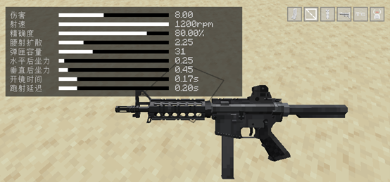

| 距离（格） | 伤害  |
|:-----:|:---:|
|  1.5  |  9  |
|  15   |  8  |
|  25   | 6.5 |
|  35   |  5  |
|   ∞   |  4  |

### COLT RO635
{: .d-inline-block }

弹药类型：9MM
{: .label .label-yellow }

护甲穿透：20%
{: .label .label-red }

爆头伤害：140%
{: .label .label-red }

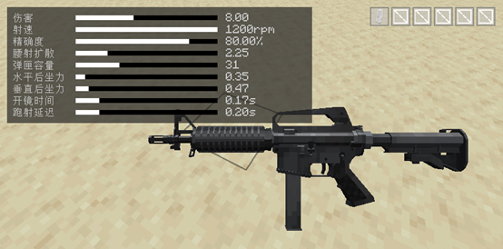

| 距离（格） | 伤害  |
|:-----:|:---:|
|  1.5  |  9  |
|  15   |  8  |
|  25   | 6.5 |
|  35   |  5  |
|   ∞   |  4  |

只能装配`扩容弹夹`

### 维克托 冲锋枪
{: .d-inline-block }

弹药类型：.45
{: .label .label-yellow }

护甲穿透：15%
{: .label .label-red }

爆头伤害：140%
{: .label .label-red }

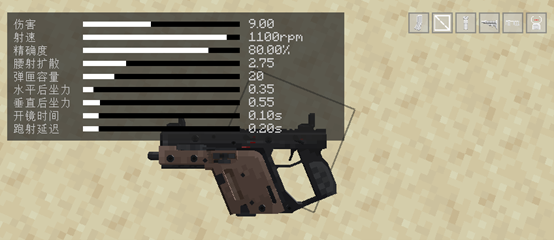

| 距离（格） | 伤害  |
|:-----:|:---:|
|  1.5  | 10  |
|  15   |  9  |
|  25   |  6  |
|  35   | 3.5 |
|   ∞   |  3  |

## 🥇T1级冲锋枪（排名不分先后）

### MP5A5
{: .d-inline-block }

弹药类型：9MM
{: .label .label-yellow }

护甲穿透：20%
{: .label .label-red }

爆头伤害：140%
{: .label .label-red }

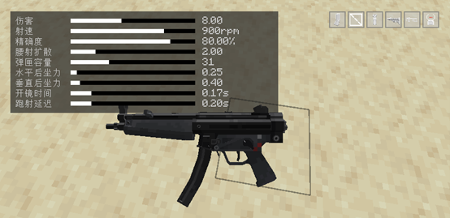

| 距离（格） | 伤害  |
|:-----:|:---:|
|  1.5  |  9  |
|  15   |  8  |
|  30   | 6.5 |
|  40   |  5  |
|   ∞   |  4  |

### UMP9
{: .d-inline-block }

弹药类型：9MM
{: .label .label-yellow }

护甲穿透：20%
{: .label .label-red }

爆头伤害：140%
{: .label .label-red }

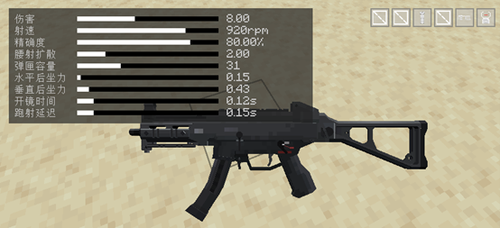

| 距离（格） | 伤害  |
|:-----:|:---:|
|  1.5  |  9  |
|  15   |  8  |
|  30   | 6.5 |
|  40   |  5  |
|   ∞   |  4  |

## 🥈T2级冲锋枪（排名不分先后）

### MP5ST
{: .d-inline-block }

弹药类型：9MM
{: .label .label-yellow }

护甲穿透：20%
{: .label .label-red }

爆头伤害：140%
{: .label .label-red }

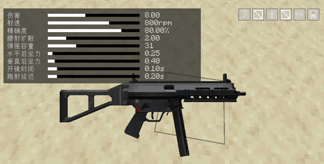

| 距离（格） | 伤害  |
|:-----:|:---:|
|  1.5  |  9  |
|  15   |  8  |
|  30   | 6.5 |
|  40   |  5  |
|   ∞   |  4  |

### 海军MP5-N
{: .d-inline-block }

弹药类型：9MM
{: .label .label-yellow }

护甲穿透：20%
{: .label .label-red }

爆头伤害：140%
{: .label .label-red }

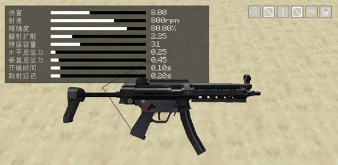

| 距离（格） | 伤害  |
|:-----:|:---:|
|  1.5  |  9  |
|  15   |  8  |
|  30   | 6.5 |
|  40   |  5  |
|   ∞   |  4  |

### 增强型 PP-19
{: .d-inline-block }

弹药类型：9MM
{: .label .label-yellow }

护甲穿透：20%
{: .label .label-red }

爆头伤害：140%
{: .label .label-red }

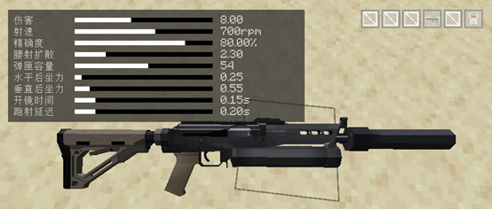

| 距离（格） | 伤害  |
|:-----:|:---:|
|  1.5  |  9  |
|  15   |  8  |
|  30   | 6.5 |
|  40   |  5  |
|   ∞   |  4  |

### UMP45
{: .d-inline-block }

弹药类型：.45
{: .label .label-yellow }

护甲穿透：15%
{: .label .label-red }

爆头伤害：140%
{: .label .label-red }

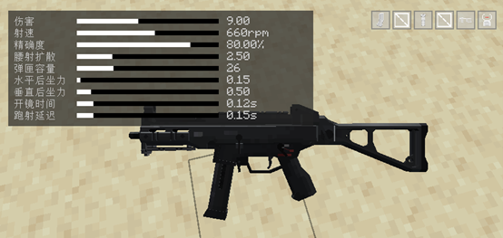

| 距离（格） | 伤害  |
|:-----:|:---:|
|  1.5  | 10  |
|  15   |  9  |
|  25   |  6  |
|  35   | 3.5 |
|   ∞   |  3  |

## 🥉T3级冲锋枪（排名不分先后）

### UZI
{: .d-inline-block }

弹药类型：9MM
{: .label .label-yellow }

护甲穿透：17%
{: .label .label-red }

爆头伤害：140%
{: .label .label-red }

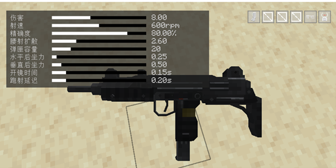

| 距离（格） | 伤害  |
|:-----:|:---:|
|  1.5  |  9  |
|  15   |  8  |
|  25   | 6.5 |
|  35   |  5  |
|   ∞   |  4  |

### PP-19
{: .d-inline-block }

弹药类型：9MM
{: .label .label-yellow }

护甲穿透：17%
{: .label .label-red }

爆头伤害：140%
{: .label .label-red }

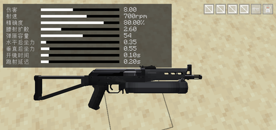

| 距离（格） | 伤害  |
|:-----:|:---:|
|  1.5  |  9  |
|  15   |  8  |
|  25   | 6.5 |
|  35   |  5  |
|   ∞   |  4  |

### 三连发 MP5A4
{: .d-inline-block }

弹药类型：9MM
{: .label .label-yellow }

护甲穿透：20%
{: .label .label-red }

爆头伤害：140%
{: .label .label-red }

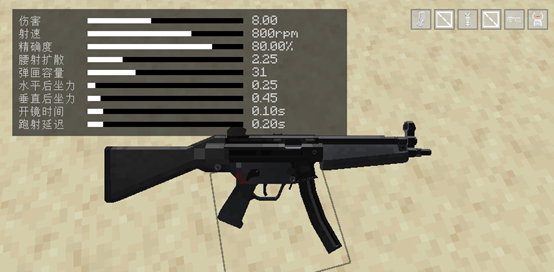

| 距离（格） | 伤害  |
|:-----:|:---:|
|  1.5  |  9  |
|  15   |  8  |
|  30   | 6.5 |
|  40   |  5  |
|   ∞   |  4  |

没有`全自动`射击模式

# 分类——步枪

绝大多数步枪穿透数为：`2`，当前共22把步枪类型武器，常用口径为`5.56×45`、`7.96×39`、`5.45×39`

## 🏆T0级步枪（排名不分先后）

### M4 URG-I（11.5寸枪管）
{: .d-inline-block }

弹药类型：5.56×45MM
{: .label .label-yellow }

护甲穿透：40%
{: .label .label-red }

爆头伤害：150%
{: .label .label-red }

DPM：13500(爆头) / 9000
{: .label .label-purple }

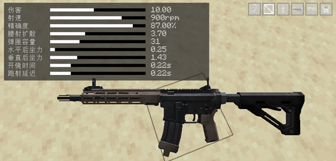

| 距离（格） | 伤害 |
|:-----:|:--:|
|  1.5  | 11 |
|  30   | 10 |
|  40   | 9  |
|  50   | 8  |
|  60   | 7  |
|   ∞   | 6  |

### n4
{: .d-inline-block }

弹药类型：5.56×45MM
{: .label .label-yellow }

护甲穿透：40%
{: .label .label-red }

爆头伤害：150%
{: .label .label-red }

DPM：12285(爆头) / 8190
{: .label .label-purple }

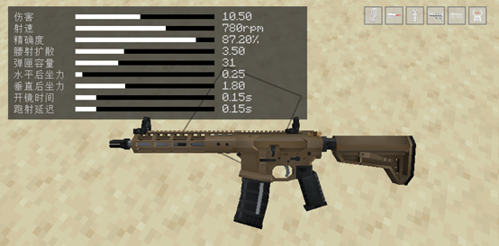

| 距离（格） |  伤害  |
|:-----:|:----:|
|  1.5  |  12  |
|  10   |  11  |
|  20   | 10.5 |
|  30   | 8.5  |
|  50   |  7   |
|   ∞   |  6   |

### AK104
{: .d-inline-block }

弹药类型：7.62×39MM
{: .label .label-yellow }

护甲穿透：30%
{: .label .label-red }

爆头伤害：170%
{: .label .label-red }

DPM：14229(爆头) / 8370
{: .label .label-purple }

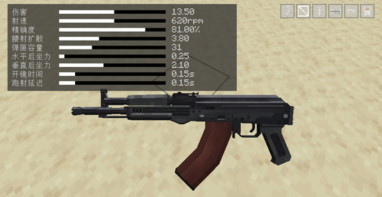

| 距离（格） |  伤害  |
|:-----:|:----:|
|  1.5  |  15  |
|  10   |  14  |
|  20   | 13.5 |
|  30   | 11.5 |
|  50   |  10  |
|   ∞   |  9   |

### AK105
{: .d-inline-block }

弹药类型：5.45×39MM
{: .label .label-yellow }

护甲穿透：35%
{: .label .label-red }

爆头伤害：165%
{: .label .label-red }

DPM：13612.5(爆头) / 8250
{: .label .label-purple }

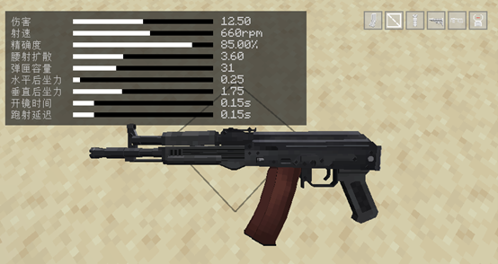

| 距离（格） |  伤害  |
|:-----:|:----:|
|  1.5  |  14  |
|  10   |  13  |
|  20   | 12.5 |
|  30   | 10.5 |
|  50   |  9   |
|   ∞   |  8   |

## 🥇T1级步枪（排名不分先后）

### M4 URG-I
{: .d-inline-block }

弹药类型：5.56×45MM
{: .label .label-yellow }

护甲穿透：40%
{: .label .label-red }

爆头伤害：150%
{: .label .label-red }

DPM：12750(爆头) / 8500
{: .label .label-purple }

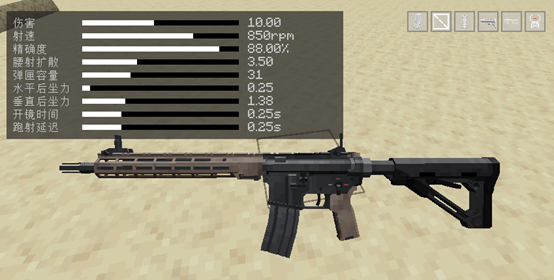

| 距离（格） | 伤害 |
|:-----:|:--:|
|  1.5  | 11 |
|  40   | 10 |
|  50   | 9  |
|  60   | 8  |
|  70   | 7  |
|   ∞   | 6  |

### 轻型 M4
{: .d-inline-block }

弹药类型：5.56×45MM
{: .label .label-yellow }

护甲穿透：40%
{: .label .label-red }

爆头伤害：150%
{: .label .label-red }

DPM：12750(爆头) / 8500
{: .label .label-purple }

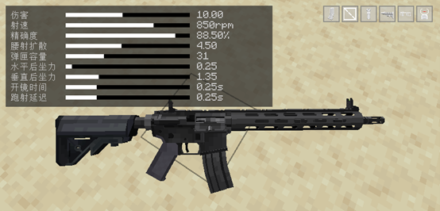

| 距离（格） | 伤害 |
|:-----:|:--:|
|  1.5  | 11 |
|  40   | 10 |
|  50   | 9  |
|  60   | 8  |
|  70   | 7  |
|   ∞   | 6  |

### AK102
{: .d-inline-block }

弹药类型：5.56×45MM
{: .label .label-yellow }

护甲穿透：40%
{: .label .label-red }

爆头伤害：150%
{: .label .label-red }

DPM：11643.75(爆头) / 7762.5
{: .label .label-purple }

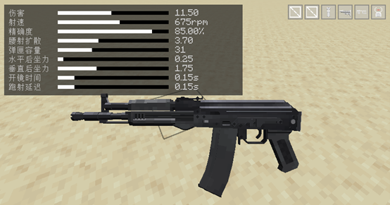

| 距离（格） |  伤害  |
|:-----:|:----:|
|  1.5  |  13  |
|  10   |  12  |
|  20   | 11.5 |
|  30   | 9.5  |
|  50   |  8   |
|   ∞   |  7   |

### AN94
{: .d-inline-block }

弹药类型：7.62×39MM
{: .label .label-yellow }

护甲穿透：30%
{: .label .label-red }

爆头伤害：170%
{: .label .label-red }

DPM：13702(爆头) / 8060
{: .label .label-purple }

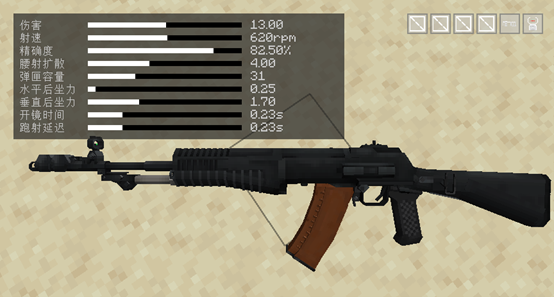

| 距离（格） | 伤害 |
|:-----:|:--:|
|  1.5  | 14 |
|  30   | 13 |
|  40   | 12 |
|  50   | 11 |
|  60   | 10 |
|   ∞   | 9  |

### 黑市 AKM
{: .d-inline-block }

弹药类型：7.62×39MM
{: .label .label-yellow }

护甲穿透：30%
{: .label .label-red }

爆头伤害：170%
{: .label .label-red }

DPM：13260(爆头) / 7800
{: .label .label-purple }

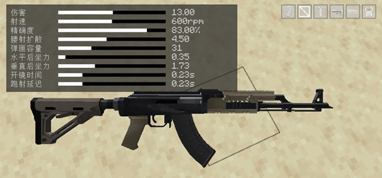

| 距离（格） | 伤害 |
|:-----:|:--:|
|  1.5  | 14 |
|  30   | 13 |
|  40   | 12 |
|  50   | 11 |
|  60   | 10 |
|   ∞   | 9  |

### AK103
{: .d-inline-block }

弹药类型：7.62×39MM
{: .label .label-yellow }

护甲穿透：30%
{: .label .label-red }

爆头伤害：170%
{: .label .label-red }

DPM：13260(爆头) / 7800
{: .label .label-purple }

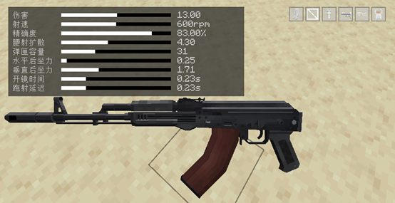

| 距离（格） | 伤害 |
|:-----:|:--:|
|  1.5  | 14 |
|  30   | 13 |
|  40   | 12 |
|  50   | 11 |
|  60   | 10 |
|   ∞   | 9  |

### AKS74U
{: .d-inline-block }

弹药类型：5.45×39MM
{: .label .label-yellow }

护甲穿透：35%
{: .label .label-red }

爆头伤害：165%
{: .label .label-red }

DPM：14231.25(爆头) / 8625
{: .label .label-purple }

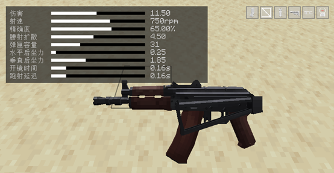

| 距离（格） |  伤害  |
|:-----:|:----:|
|  1.5  |  13  |
|  10   |  12  |
|  20   | 11.5 |
|  30   | 9.5  |
|  50   |  8   |
|   ∞   |  7   |

### AK74M
{: .d-inline-block }

弹药类型：5.45×39MM
{: .label .label-yellow }

护甲穿透：35%
{: .label .label-red }

爆头伤害：165%
{: .label .label-red }

DPM：13068(爆头) / 7920
{: .label .label-purple }

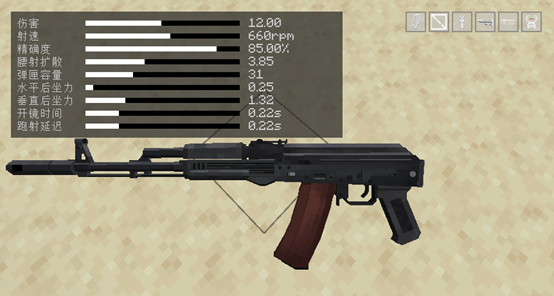

| 距离（格） | 伤害 |
|:-----:|:--:|
|  1.5  | 13 |
|  30   | 12 |
|  40   | 11 |
|  50   | 10 |
|  60   | 9  |
|   ∞   | 8  |

### QBZ95-1
{: .d-inline-block }

弹药类型：5.8MM
{: .label .label-yellow }

护甲穿透：45%
{: .label .label-red }

爆头伤害：170%
{: .label .label-red }

DPM：12609.75(爆头) / 7417.5
{: .label .label-purple }

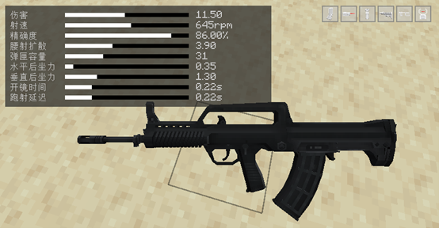

| 距离（格） |  伤害  |
|:-----:|:----:|
|  1.5  | 12.5 |
|  30   | 11.5 |
|  40   | 10.5 |
|  50   | 9.5  |
|  60   | 8.5  |
|   ∞   | 7.5  |

## 🥈T2级步枪（排名不分先后）

### M4A1
{: .d-inline-block }

弹药类型：5.56×45MM
{: .label .label-yellow }

护甲穿透：40%
{: .label .label-red }

爆头伤害：150%
{: .label .label-red }

DPM：12750(爆头) / 8500
{: .label .label-purple }

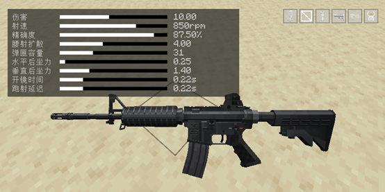

| 距离（格） | 伤害 |
|:-----:|:--:|
|  1.5  | 11 |
|  30   | 10 |
|  40   | 9  |
|  50   | 8  |
|  60   | 7  |
|   ∞   | 6  |

### AK101
{: .d-inline-block }

弹药类型：5.56×45MM
{: .label .label-yellow }

护甲穿透：40%
{: .label .label-red }

爆头伤害：150%
{: .label .label-red }

DPM：11137.5(爆头) / 7425
{: .label .label-purple }

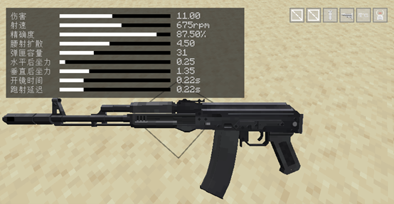

| 距离（格） | 伤害 |
|:-----:|:--:|
|  1.5  | 12 |
|  30   | 11 |
|  40   | 10 |
|  50   | 9  |
|  60   | 8  |
|   ∞   | 7  |

### AKM
{: .d-inline-block }

弹药类型：7.62×39MM
{: .label .label-yellow }

护甲穿透：30%
{: .label .label-red }

爆头伤害：170%
{: .label .label-red }

DPM：13260(爆头) / 7800
{: .label .label-purple }

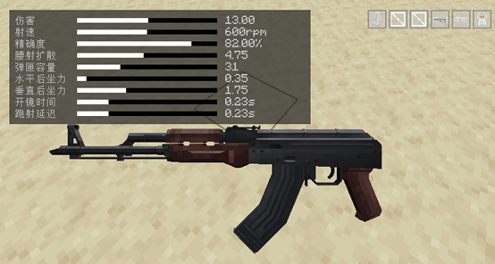

| 距离（格） | 伤害 |
|:-----:|:--:|
|  1.5  | 14 |
|  30   | 13 |
|  40   | 12 |
|  50   | 11 |
|  60   | 10 |
|   ∞   | 9  |

## 🥉T3级步枪（排名不分先后）

### M723
{: .d-inline-block }

弹药类型：5.56×45MM
{: .label .label-yellow }

护甲穿透：40%
{: .label .label-red }

爆头伤害：150%
{: .label .label-red }

DPM：12000(爆头) / 8000
{: .label .label-purple }

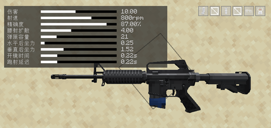

| 距离（格） | 伤害 |
|:-----:|:--:|
|  1.5  | 11 |
|  30   | 10 |
|  40   | 9  |
|  50   | 8  |
|  60   | 7  |
|   ∞   | 6  |

### 军规 P416
{: .d-inline-block }

弹药类型：5.56×45MM
{: .label .label-yellow }

护甲穿透：40%
{: .label .label-red }

爆头伤害：150%
{: .label .label-red }

DPM：11250(爆头) / 7500
{: .label .label-purple }

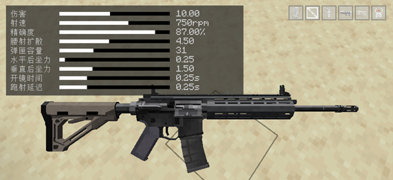

| 距离（格） | 伤害 |
|:-----:|:--:|
|  1.5  | 11 |
|  40   | 10 |
|  50   | 9  |
|  60   | 8  |
|  70   | 7  |
|   ∞   | 6  |

### M733
{: .d-inline-block }

弹药类型：5.56×45MM
{: .label .label-yellow }

护甲穿透：40%
{: .label .label-red }

爆头伤害：150%
{: .label .label-red }

DPM：13500(爆头) / 9000
{: .label .label-purple }

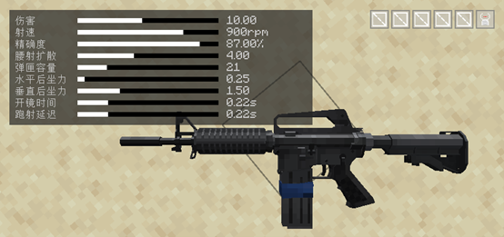

| 距离（格） | 伤害 |
|:-----:|:--:|
|  1.5  | 11 |
|  30   | 10 |
|  40   | 9  |
|  50   | 8  |
|  60   | 7  |
|   ∞   | 6  |

### M16A1
{: .d-inline-block }

弹药类型：5.56×45MM
{: .label .label-yellow }

护甲穿透：40%
{: .label .label-red }

爆头伤害：150%
{: .label .label-red }

DPM：11250(爆头) / 7500
{: .label .label-purple }

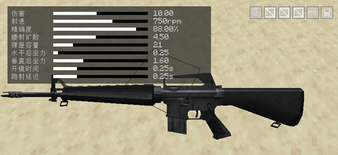

| 距离（格） | 伤害 |
|:-----:|:--:|
|  1.5  | 11 |
|  40   | 10 |
|  50   | 9  |
|  60   | 8  |
|  70   | 7  |
|   ∞   | 6  |

### M16A1
{: .d-inline-block }

弹药类型：5.56×45MM
{: .label .label-yellow }

护甲穿透：40%
{: .label .label-red }

爆头伤害：150%
{: .label .label-red }

DPM：6000(爆头) / 4000
{: .label .label-purple }

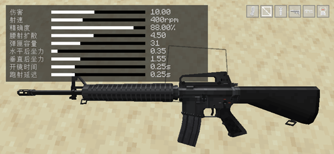

| 距离（格） | 伤害 |
|:-----:|:--:|
|  1.5  | 11 |
|  40   | 10 |
|  50   | 9  |
|  60   | 8  |
|  70   | 7  |
|   ∞   | 6  |

没有`全自动`射击模式

## T4级步枪（排名不分先后）

### 警用 M4
{: .d-inline-block }

弹药类型：5.56×45MM
{: .label .label-yellow }

护甲穿透：30%
{: .label .label-red }

爆头伤害：145%
{: .label .label-red }

DPM：11092.5(爆头) / 7650
{: .label .label-purple }

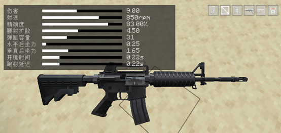

| 距离（格） | 伤害 |
|:-----:|:--:|
|  1.5  | 10 |
|  30   | 9  |
|  40   | 8  |
|  50   | 7  |
|  60   | 6  |
|   ∞   | 5  |

穿透数为：`1`

# 分类——精确射手步枪
穿透数为：`3`，当前共3把精确射手步枪类型武器

## 🏆T0级精确射手步枪（排名不分先后）

### SCAR-H
{: .d-inline-block }

弹药类型：.308温彻斯特
{: .label .label-yellow }

护甲穿透：55%
{: .label .label-red }

爆头伤害：170%
{: .label .label-red }

DPM：15504(爆头) / 9120
{: .label .label-purple }

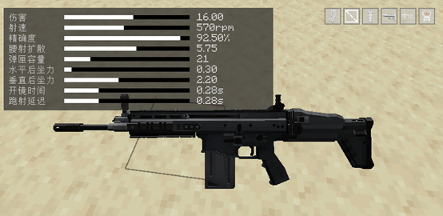

| 距离（格） |  伤害  |
|:-----:|:----:|
|  1.5  |  17  |
|  55   |  16  |
|  65   | 15.5 |
|  75   |  15  |
|   ∞   | 14.5 |

## 🥇T1级精确射手步枪（排名不分先后）

### G3
{: .d-inline-block }

弹药类型：.308温彻斯特
{: .label .label-yellow }

护甲穿透：55%
{: .label .label-red }

爆头伤害：170%
{: .label .label-red }

DPM：14960(爆头) / 8800
{: .label .label-purple }

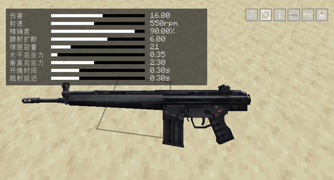

| 距离（格） |  伤害  |
|:-----:|:----:|
|  1.5  |  17  |
|  55   |  16  |
|  65   | 15.5 |
|  75   |  15  |
|   ∞   | 14.5 |

## 🥈T2级精确射手步枪（排名不分先后）

### SKS
{: .d-inline-block }

弹药类型：7.62×39mm
{: .label .label-yellow }

护甲穿透：45%
{: .label .label-red }

爆头伤害：175%
{: .label .label-red }

DPM：15172.5(爆头) / 8670
{: .label .label-purple }

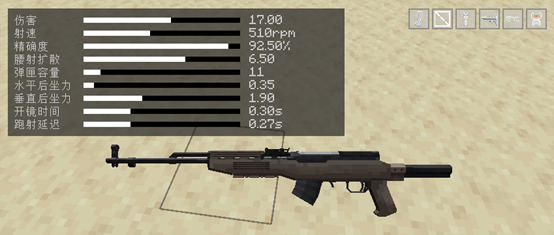

| 距离（格） |  伤害  |
|:-----:|:----:|
|  1.5  |  18  |
|  55   |  17  |
|  65   | 16.5 |
|  75   |  16  |
|   ∞   | 15.5 |

# 分类——机枪
穿透数为：`2`，当前共5把机枪类型武器

## 🏆T0级机枪（排名不分先后）

### PKP
{: .d-inline-block }

弹药类型：7.62×54mm
{: .label .label-yellow }

护甲穿透：50%
{: .label .label-red }

爆头伤害：170%
{: .label .label-red }

DPM：15886.5(爆头) / 9345
{: .label .label-purple }

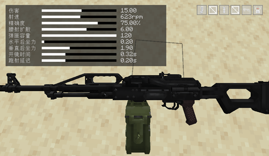

| 距离（格） | 伤害 |
|:-----:|:--:|
|  1.5  | 16 |
|  40   | 15 |
|  50   | 14 |
|  60   | 13 |
|  70   | 12 |
|   ∞   | 11 |

## 🥇T1级机枪（排名不分先后）

### M249
{: .d-inline-block }

弹药类型：5.56×45mm
{: .label .label-yellow }

护甲穿透：40%
{: .label .label-red }

爆头伤害：150%
{: .label .label-red }

DPM：12750(爆头) / 8500
{: .label .label-purple }

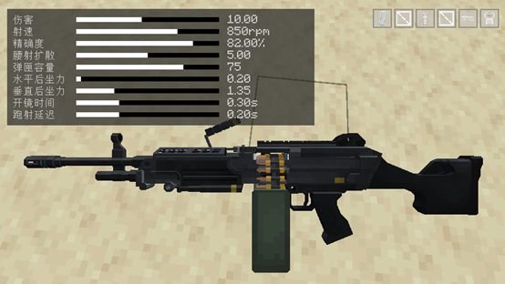

| 距离（格） | 伤害 |
|:-----:|:--:|
|  1.5  | 11 |
|  35   | 10 |
|  45   | 9  |
|  55   | 8  |
|  65   | 7  |
|   ∞   | 6  |

### RPK
{: .d-inline-block }

弹药类型：7.62×39mm
{: .label .label-yellow }

护甲穿透：30%
{: .label .label-red }

爆头伤害：170%
{: .label .label-red }

DPM：13260(爆头) / 7800
{: .label .label-purple }

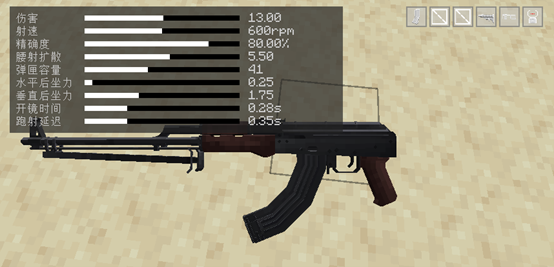

| 距离（格） | 伤害 |
|:-----:|:--:|
|  1.5  | 14 |
|  35   | 13 |
|  45   | 12 |
|  55   | 11 |
|  65   | 10 |
|   ∞   | 9  |

### 经典 RPK74
{: .d-inline-block }

弹药类型：5.45×39mm
{: .label .label-yellow }

护甲穿透：35%
{: .label .label-red }

爆头伤害：165%
{: .label .label-red }

DPM：12870(爆头) / 7800
{: .label .label-purple }

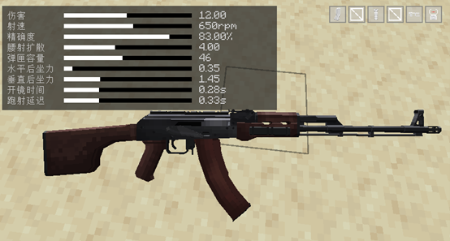

| 距离（格） | 伤害 |
|:-----:|:--:|
|  1.5  | 13 |
|  35   | 12 |
|  45   | 11 |
|  55   | 10 |
|  65   | 9  |
|   ∞   | 8  |

# 分类——霰弹枪
当前共5把霰弹枪类型武器

## 🏆T0级霰弹枪（排名不分先后）

### 战术 Saiga-12K
{: .d-inline-block }

弹药类型：12号口径霰弹
{: .label .label-yellow }

护甲穿透：10%
{: .label .label-red }

爆头伤害：170%
{: .label .label-red }

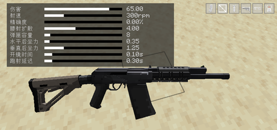

| 距离（格） | 伤害 |
|:-----:|:--:|
|   5   | 70 |
|  15   | 65 |
|  20   | 55 |
|  25   | 45 |
|  30   | 30 |
|  35   | 20 |
|   ∞   | 10 |

### Saiga-12
{: .d-inline-block }

弹药类型：12号口径霰弹
{: .label .label-yellow }

护甲穿透：10%
{: .label .label-red }

爆头伤害：170%
{: .label .label-red }

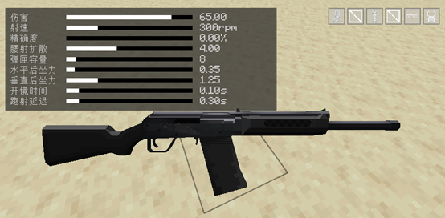

| 距离（格） | 伤害 |
|:-----:|:--:|
|   5   | 70 |
|  15   | 65 |
|  20   | 55 |
|  25   | 45 |
|  30   | 30 |
|  35   | 20 |
|   ∞   | 10 |

### AA12
{: .d-inline-block }

弹药类型：12号口径霰弹
{: .label .label-yellow }

护甲穿透：10%
{: .label .label-red }

爆头伤害：170%
{: .label .label-red }

| 距离（格） | 伤害 |
|:-----:|:--:|
|   5   | 70 |
|  15   | 65 |
|  20   | 55 |
|  25   | 45 |
|  30   | 30 |
|  35   | 20 |
|   ∞   | 10 |

## 🥇T1级霰弹枪（排名不分先后）

### DB-4
{: .d-inline-block }

弹药类型：12号口径霰弹
{: .label .label-yellow }

护甲穿透：10%
{: .label .label-red }

爆头伤害：170%
{: .label .label-red }

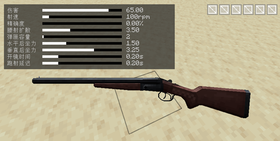

| 距离（格） | 伤害 |
|:-----:|:--:|
|   5   | 70 |
|  15   | 65 |
|  20   | 55 |
|  25   | 45 |
|  30   | 30 |
|  35   | 20 |
|   ∞   | 10 |

## 🥈T2级霰弹枪（排名不分先后）

### DB-2
{: .d-inline-block }

弹药类型：12号口径霰弹
{: .label .label-yellow }

护甲穿透：10%
{: .label .label-red }

爆头伤害：170%
{: .label .label-red }

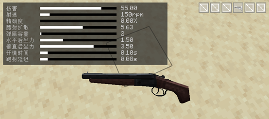

| 距离（格） | 伤害 |
|:-----:|:--:|
|   3   | 60 |
|  10   | 55 |
|  15   | 40 |
|  20   | 30 |
|  25   | 20 |
|   ∞   | 10 |
