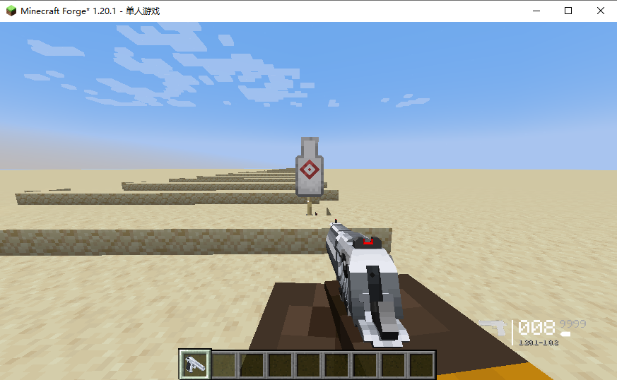
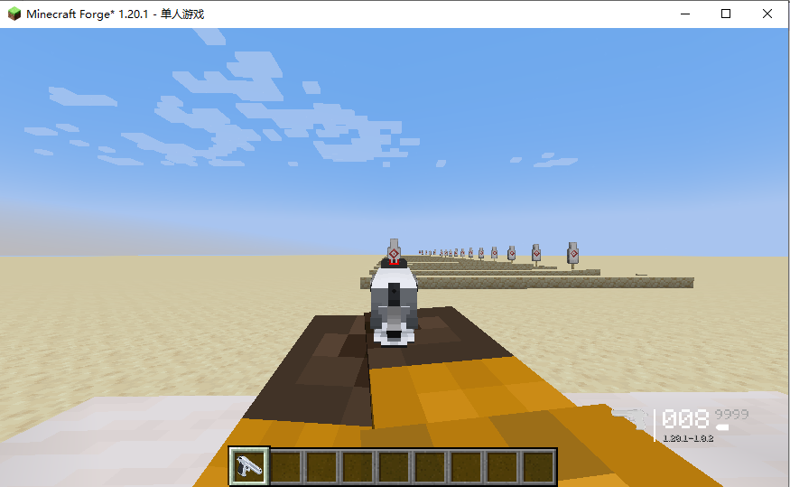
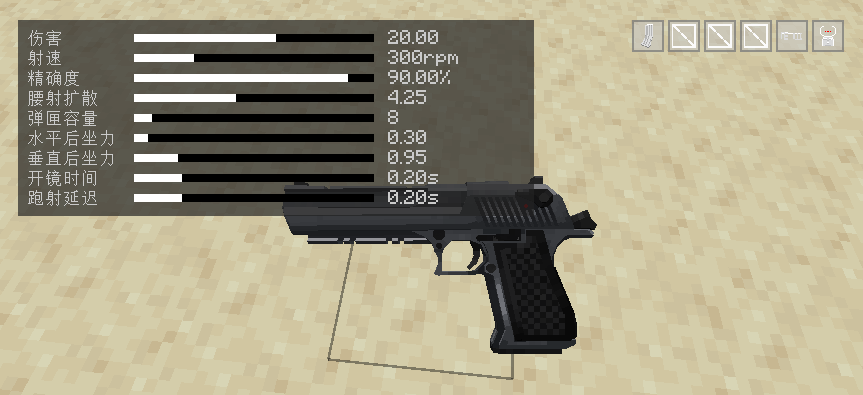
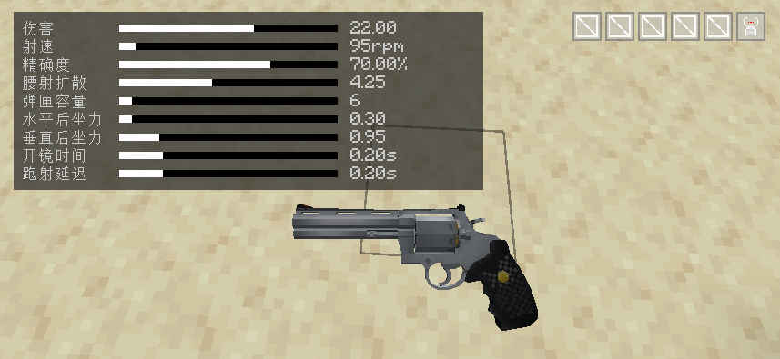
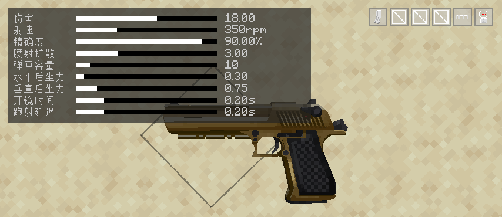
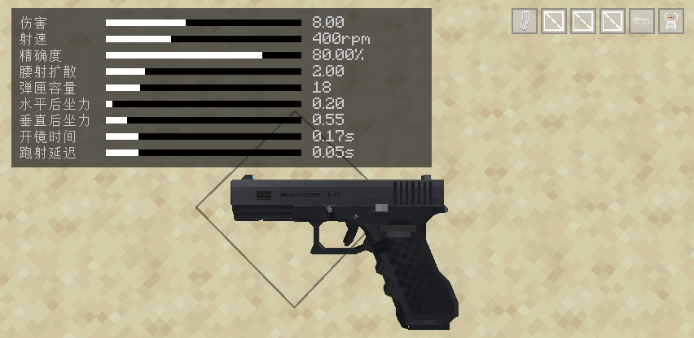
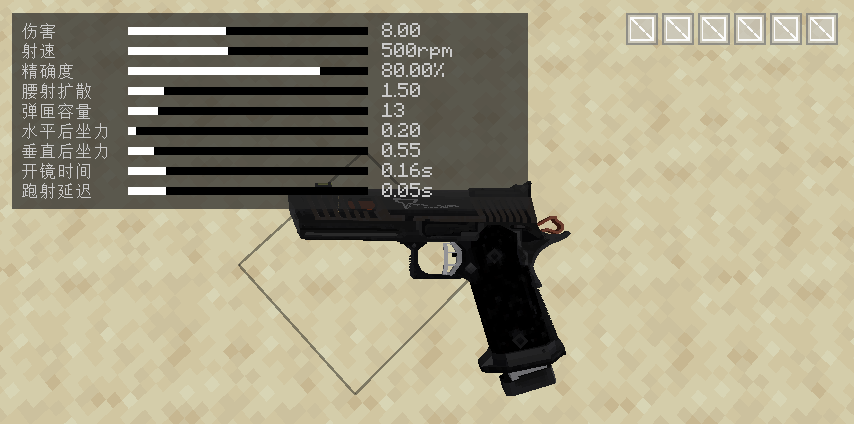
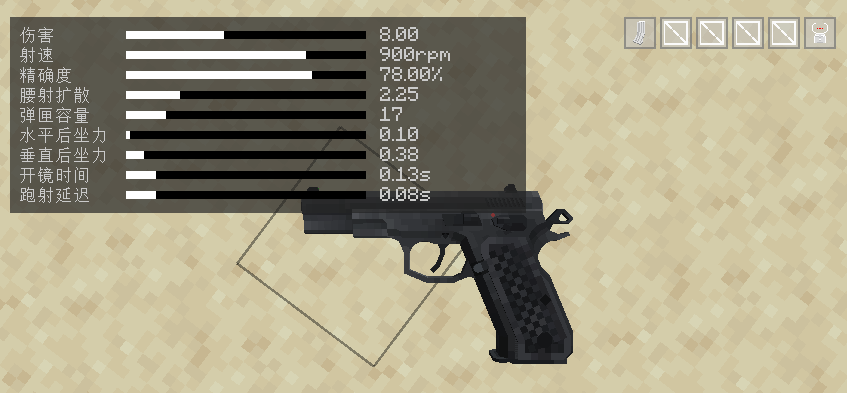

## 枪械数据 V0.8.0 更新内容概览

{: .highlight }
* 提升了所有步枪分类的垂直后座力
* 重新平衡了不同口径步枪的DPM（伤害/分钟）
* 修改了RPK74和黑市RPK74的子弹类型（由7.62 * 39改为正确的5.45 * 39），主要用于用于区分原版RPK
* 提升了RPG的伤害
* 修改了霰弹枪伤害（可能还需调整）
* 修改了步枪类型、冲锋枪类型与手枪类型的伤害

# 分类——手枪

手枪目前设定为近距离防身用武器，当前共6把手枪类型武器，伤害提升范围为5格。正常交战距离(标注伤害最远距离)为15米与20米

 图例模拟距离为5米（近距离） 

 图例模拟距离为15米（中近距离） 

## 🏆T0级手枪（排名不分先后）

### 沙漠之鹰
{: .d-inline-block }

弹药类型：.50AE
{: .label .label-yellow }

护甲穿透：35%
{: .label .label-red }

爆头伤害：170%
{: .label .label-red }

| 距离（格） |  伤害  |
|:-----:|:----:|
|   5   |  22  |
|  20   |  20  |
|  30   |  16  |
|  40   |  13  |
|  50   | 10.5 |
|  ∞    |  10  |

### 柯尔特-蟒蛇
{: .d-inline-block }

弹药类型：.50AE
{: .label .label-yellow }

护甲穿透：35%
{: .label .label-red }

爆头伤害：170%
{: .label .label-red }

| 距离（格） |  伤害  |
|:-----:|:----:|
|   5   |  24  |
|  20   |  22  |
|  30   |  15.5  |
|  40   |  10  |
|  ∞    |  9  |

相较于沙漠之鹰，伤害增加了`2`点，但是更大的距离衰减与其较小的弹容使得`柯尔特-蟒蛇`只适合用于紧急防身

## 🥇T1级手枪（排名不分先后）

### 黄金沙漠之鹰
{: .d-inline-block }

弹药类型：.357MAG
{: .label .label-yellow }

护甲穿透：30%
{: .label .label-red }

爆头伤害：165%
{: .label .label-red }

| 距离（格） |  伤害  |
|:-----:|:----:|
|   5   |  20  |
|  20   |  18  |
|  30   |  14  |
|  40   |  11  |
|  50   |  9  |
|  ∞    |  8.5  |

*为收藏品枪械

### 格洛克17
{: .d-inline-block }

弹药类型：9MM
{: .label .label-yellow }

护甲穿透：15%
{: .label .label-red }

爆头伤害：140%
{: .label .label-red }

| 距离（格） |  伤害  |
|:-----:|:----:|
|   5   |  9  |
|  15   |  8  |
|  25   |  6  |
|  35   |  4  |
|  ∞    |  3  |

### TTI Pit Viper-蝮蛇
{: .d-inline-block }

弹药类型：9MM
{: .label .label-yellow }

护甲穿透：15%
{: .label .label-red }

爆头伤害：140%
{: .label .label-red }

| 距离（格） |  伤害  |
|:-----:|:----:|
|   5   |  9  |
|  15   |  8  |
|  25   |  6  |
|  35   |  4  |
|  ∞    |  3  |

精准度与射速略优于`格洛克17`，但无法装配任何配件

## 🥈T2级手枪（排名不分先后）

### CZ-75
{: .d-inline-block }

弹药类型：9MM
{: .label .label-yellow }

护甲穿透：15%
{: .label .label-red }

爆头伤害：140%
{: .label .label-red }

| 距离（格） |  伤害  |
|:-----:|:----:|
|   5   |  9  |
|  15   |  8  |
|  25   |  6  |
|  35   |  4  |
|  ∞    |  3  |

*可全自动射击的9mm手枪

